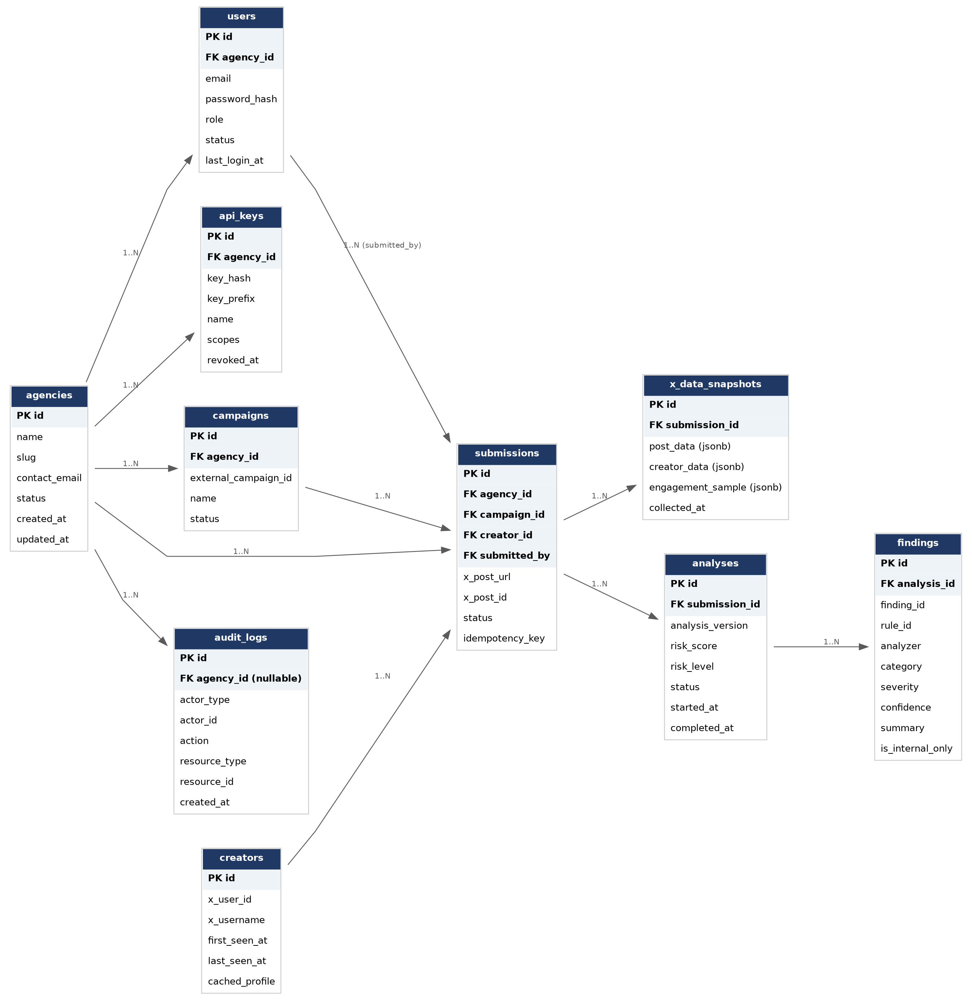

# Database Design & Entity Relationship Diagram

*DDS — Database Design Specification*

**Project:** Campaign Integrity API

**Version:** 1.0 (Draft)

**Status:** Draft

**Based On:** PRD v1.1, SRS v1.0, TAS v1.0, Detection Engine Specification v1.0, Rule Library Specification v1.0

## 1. Purpose

This document defines the relational data model for Campaign Integrity API: the entities the platform persists, their fields, and the relationships between them. It translates the functional requirements in the SRS, the pipeline described in the Detection Engine Specification (DES), and the Finding structure described in the Rule Library Specification (RLS) into a concrete PostgreSQL schema.

## 2. Design Principles

- Internal vs. external separation. Fields the DES marks as "never exposed" (individual analyzer scores, signal weights, detection thresholds, internal confidence) are stored in raw_signal_snapshot and findings.details, which are excluded from every public API response by default.

- Rules stay in code, not in the database. Per the Technical Architecture Specification, rule definitions live as version-controlled TypeScript files. The database stores references to a rule_id and rule_version string — there is no rules table.

- Findings, not raw rule output, are the unit of storage. Every rule produces a Finding (RLS §10); the findings table is the single place the Risk Aggregator and Evidence Generator both read from.

- Re-analysis is a first-class case. A submission has one row, but can accumulate multiple analyses rows over time (engine upgrades, re-review), each pinned to the analysis_version that produced it — preserving reproducibility (RLS §8).

- Raw collected data is persisted, not just cached. x_data_snapshots stores what was retrieved from X at collection time, separately from the Redis cache used for performance. This is what makes an analysis auditable and reproducible after the fact.

- Multi-tenancy via agency_id. Every agency-owned row carries agency_id so row-level scoping and future per-tenant partitioning are straightforward.

## 3. Entity Relationship Diagram

Primary keys are shaded; foreign keys are labelled FK.

## 4. Entities

#### agencies

A Web3 campaign agency using the platform (the primary customer / tenant).

| **Field**               | **Type**                | **Notes**           |
|-------------------------|-------------------------|---------------------|
| id                      | UUID (PK)               | Primary key         |
| name                    | VARCHAR(255)            | Agency display name |
| slug                    | VARCHAR(100), unique    | URL-safe identifier |
| contact_email           | VARCHAR(255)            | Primary contact     |
| status                  | ENUM(active, suspended) | Account status      |
| created_at / updated_at | TIMESTAMPTZ             | Audit timestamps    |

#### users

Internal dashboard users belonging to an agency (or platform staff).

| **Field**               | **Type**                               | **Notes**                     |
|-------------------------|----------------------------------------|-------------------------------|
| id                      | UUID (PK)                              | Primary key                   |
| agency_id               | UUID (FK -\> agencies.id), nullable    | Null for platform-level staff |
| email                   | VARCHAR(255), unique                   | Login identifier              |
| password_hash           | VARCHAR(255)                           | Bcrypt/Argon2 hash            |
| role                    | ENUM (see Auth & Authorization Design) | RBAC role                     |
| status                  | ENUM(active, invited, disabled)        | Account lifecycle             |
| last_login_at           | TIMESTAMPTZ, nullable                  |                               |
| created_at / updated_at | TIMESTAMPTZ                            |                               |

#### api_keys

Machine credentials agencies use to call the REST API (FR-008).

| **Field**    | **Type**                  | **Notes**                                               |
|--------------|---------------------------|---------------------------------------------------------|
| id           | UUID (PK)                 |                                                         |
| agency_id    | UUID (FK -\> agencies.id) |                                                         |
| key_hash     | VARCHAR(255)              | Hash of the secret; secret is shown once on creation    |
| key_prefix   | VARCHAR(16)               | Non-secret prefix shown in dashboard, e.g. ci_live_8f2a |
| name         | VARCHAR(100)              | Human label                                             |
| scopes       | JSONB                     | e.g. \["submissions:write", "analyses:read"\]           |
| last_used_at | TIMESTAMPTZ, nullable     |                                                         |
| revoked_at   | TIMESTAMPTZ, nullable     |                                                         |
| created_at   | TIMESTAMPTZ               |                                                         |

#### campaigns

Optional reference to the agency's own campaign, used to group submissions.

| **Field**               | **Type**                  | **Notes**                            |
|-------------------------|---------------------------|--------------------------------------|
| id                      | UUID (PK)                 |                                      |
| agency_id               | UUID (FK -\> agencies.id) |                                      |
| external_campaign_id    | VARCHAR(255), nullable    | The agency's own campaign identifier |
| name                    | VARCHAR(255)              |                                      |
| status                  | ENUM(draft, active, closed)| Draft on create; active -> closed lifecycle |
| created_at / updated_at | TIMESTAMPTZ               |                                      |

#### campaign_analyses

Aggregated analysis snapshot across a campaign's submissions. Distinct from the per-submission `analyses` table. Sequential versioning per campaign; append-only audit trail.

| **Field**      | **Type**                                           | **Notes**                                     |
|----------------|----------------------------------------------------|-----------------------------------------------|
| id             | UUID (PK)                                          |                                               |
| campaign_id    | UUID (FK -> campaigns.id)                          | Cascade delete with campaign                  |
| version        | INTEGER                                            | Incrementing version per campaign (1, 2, ...) |
| status         | ENUM(pending, completed, failed, stale)            | Marked stale upon campaign reopen             |
| trigger        | ENUM(manual, campaign_closed)                      | What initiated this analysis run              |
| is_stale       | BOOLEAN                                            | Default false; set true on campaign reopen    |
| created_at     | TIMESTAMPTZ                                        |                                               |
| completed_at   | TIMESTAMPTZ, nullable                              |                                               |

#### creators

An X account that has submitted content. Backs the Campaign Intelligence Layer (CIL).

| **Field**               | **Type**            | **Notes**                                          |
|-------------------------|---------------------|----------------------------------------------------|
| id                      | UUID (PK)           |                                                    |
| x_user_id               | VARCHAR(64), unique | X's numeric account ID                             |
| x_username              | VARCHAR(100)        | Denormalized for lookups; X usernames can change   |
| first_seen_at           | TIMESTAMPTZ         | First time this creator was analyzed               |
| last_seen_at            | TIMESTAMPTZ         |                                                    |
| cached_profile          | JSONB               | Last known profile snapshot (followers, age, etc.) |
| created_at / updated_at | TIMESTAMPTZ         |                                                    |

#### submissions

One X post submitted for analysis (FR-001).

| **Field**               | **Type**                                                        | **Notes**                       |
|-------------------------|-----------------------------------------------------------------|---------------------------------|
| id                      | UUID (PK)                                                       |                                 |
| agency_id               | UUID (FK -\> agencies.id)                                       |                                 |
| campaign_id             | UUID (FK -\> campaigns.id), nullable                            |                                 |
| creator_id              | UUID (FK -\> creators.id), nullable                             | Resolved after data collection  |
| submitted_by            | UUID (FK -\> users.id), nullable                                | Null when submitted via API key |
| x_post_url              | TEXT                                                            | As submitted                    |
| x_post_id               | VARCHAR(64)                                                     | Parsed from the URL             |
| status                  | ENUM(pending, validating, queued, analyzing, completed, failed) | Pipeline status (DES Stage 1-2) |
| idempotency_key         | VARCHAR(255), nullable, unique per agency                       | Prevents duplicate submissions  |
| reviewer_note           | TEXT, nullable                                                  | Optional reviewer commentary (DUXS §4.3) |
| reviewed_by             | UUID (FK -> users.id), nullable                                 | Reviewer user ID (DUXS §4.3)    |
| reviewed_at             | TIMESTAMPTZ, nullable                                           | Timestamp when marked reviewed  |
| created_at / updated_at | TIMESTAMPTZ                                                     |                                 |

#### x_data_snapshots

Raw public data retrieved from X for a submission (DES Stage 1 — Data Collection). Persisted for reproducibility and re-analysis.

| **Field**         | **Type**                     | **Notes**                                                |
|-------------------|------------------------------|----------------------------------------------------------|
| id                | UUID (PK)                    |                                                          |
| submission_id     | UUID (FK -\> submissions.id) |                                                          |
| post_data         | JSONB                        | Post metadata + public metrics                           |
| creator_data      | JSONB                        | Creator profile metadata at collection time              |
| engagement_sample | JSONB                        | Sampled liking/replying users used for audience analysis |
| collected_at      | TIMESTAMPTZ                  |                                                          |

#### analyses

One completed (or attempted) run of the Detection Engine against a submission. Supports re-analysis, so a submission can have several.

| **Field**                 | **Type**                                         | **Notes**                                                    |
|---------------------------|--------------------------------------------------|--------------------------------------------------------------|
| id                        | UUID (PK)                                        |                                                              |
| submission_id             | UUID (FK -\> submissions.id)                     |                                                              |
| analysis_version          | VARCHAR(50)                                      | Engine + rule-set version that produced this result (RLS §8) |
| risk_score                | SMALLINT (0–100)                                 | FR-005                                                       |
| risk_level                | ENUM(low, moderate, high, critical)              | Derived from risk_score thresholds                           |
| status                    | ENUM(completed, failed)                          |                                                              |
| raw_signal_snapshot       | JSONB — internal only, never returned by the API | Individual analyzer scores, weights, thresholds (DES §9)     |
| started_at / completed_at | TIMESTAMPTZ                                      |                                                              |
| created_at                | TIMESTAMPTZ                                      |                                                              |

#### findings

One structured Finding produced by a detection rule (RLS §10). The Risk Aggregator and Evidence Generator both consume Findings.

| **Field**        | **Type**                                                                                   | **Notes**                                                               |
|------------------|--------------------------------------------------------------------------------------------|-------------------------------------------------------------------------|
| id               | UUID (PK)                                                                                  |                                                                         |
| analysis_id      | UUID (FK -\> analyses.id)                                                                  |                                                                         |
| finding_id       | VARCHAR(50)                                                                                | e.g. F-E001                                                             |
| rule_id          | VARCHAR(20)                                                                                | e.g. E001 — references the rule defined in code, not a DB row (see TAS) |
| analyzer         | ENUM(post, account, engagement, audience, behavior, coordination, bot_network, historical) |                                                                         |
| category         | VARCHAR(50)                                                                                |                                                                         |
| severity         | ENUM(low, medium, high, critical)                                                          |                                                                         |
| confidence       | DECIMAL(3,2)                                                                               | 0.00–1.00                                                               |
| summary          | TEXT                                                                                       | Reviewer-facing evidence sentence — exposed via API                     |
| details          | JSONB — internal only                                                                      | Supporting measurements (DES §9: never exposed)                         |
| is_internal_only | BOOLEAN                                                                                    | True for findings that inform scoring but are not surfaced as evidence  |
| rule_version     | VARCHAR(20)                                                                                |                                                                         |
| created_at       | TIMESTAMPTZ                                                                                |                                                                         |

#### audit_logs

Immutable log of security-relevant and operational events (FR-010).

| **Field**                   | **Type**                            | **Notes**                                                    |
|-----------------------------|-------------------------------------|--------------------------------------------------------------|
| id                          | UUID (PK)                           |                                                              |
| agency_id                   | UUID (FK -\> agencies.id), nullable | Null for platform-level events                               |
| actor_type                  | ENUM(user, api_key, system)         |                                                              |
| actor_id                    | UUID, nullable                      |                                                              |
| action                      | VARCHAR(100)                        | e.g. submission.created, analysis.completed, api_key.revoked |
| resource_type / resource_id | VARCHAR(50) / UUID                  |                                                              |
| metadata                    | JSONB                               | Additional context                                           |
| ip_address                  | INET, nullable                      |                                                              |
| created_at                  | TIMESTAMPTZ                         |                                                              |

## 5. Relationships

| **From**    | **To**           | **Cardinality** | **Notes**                                  |
|-------------|------------------|-----------------|--------------------------------------------|
| agencies    | users            | 1..N            | An agency has many dashboard users         |
| agencies    | api_keys         | 1..N            |                                            |
| agencies    | campaigns        | 1..N            |                                            |
| agencies    | submissions      | 1..N            |                                            |
| campaigns   | submissions      | 1..N            | Optional — campaign_id nullable            |
| creators    | submissions      | 1..N            | Resolved after data collection             |
| users       | submissions      | 1..N            | submitted_by, nullable for API submissions |
| users       | submissions      | 1..N            | reviewed_by, reviewer note attribution     |
| submissions | x_data_snapshots | 1..N            | Typically 1, more on re-collection         |
| submissions | analyses         | 1..N            | Supports re-analysis                       |
| analyses    | findings         | 1..N            |                                            |
| agencies    | audit_logs       | 1..N            | Nullable for platform-level events         |
| campaigns   | campaign_analyses| 1..N            | Versioned sequential campaign analyses     |

## 6. Indexing Strategy

- submissions: composite index on (agency_id, status, created_at) for dashboard queue queries; unique index on (agency_id, idempotency_key) where idempotency_key is not null; index on x_post_id for duplicate-post lookups.

- analyses: index on (submission_id, created_at DESC) to fetch the latest analysis quickly.

- findings: index on (analysis_id, severity).

- creators: unique index on x_user_id.

- api_keys: unique index on key_prefix; index on agency_id.

- audit_logs: index on (agency_id, created_at DESC); index on (actor_type, actor_id).

## 7. Data Retention & Auditability

Analyses, findings, and audit_logs are append-only in normal operation — rows are not mutated after creation, only superseded by a new analyses row on re-analysis. This preserves the audit trail described in SRS §5 (Security) and supports the CIL’s use of historical Risk Scores (DES §6).

## 8. Migration Ownership

Schema migrations are owned by the backend (NestJS + a SQL migration tool such as TypeORM/Prisma migrations, per the Backend Folder Structure document) and run as an explicit CI/CD deployment step — never applied ad hoc against production. See CI/CD Strategy for the migration gate.
