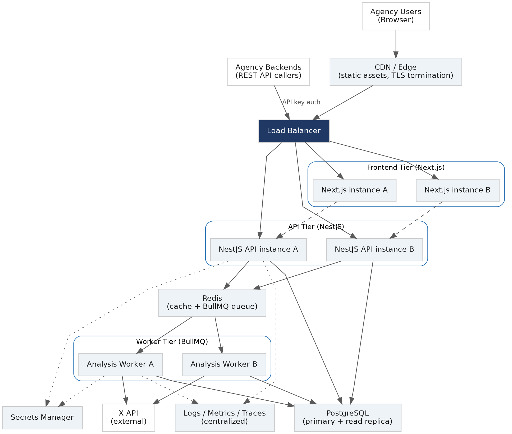

# Deployment Architecture

*DA — Deployment Architecture*

**Project:** Campaign Integrity API

**Version:** 1.0 (Draft)

**Status:** Draft

**Based On:** TAS v1.0 (NestJS, Next.js, PostgreSQL, Redis, BullMQ), CI/CD Strategy v1.0

## 1. Purpose

Describes how Campaign Integrity API is deployed and scaled in staging and production. The architecture is containerized and cloud-agnostic by design — it assumes a container orchestrator (e.g. ECS, Kubernetes, or a managed platform such as Render/Fly.io) rather than committing to a specific vendor, consistent with the Technical Architecture Specification.

## 2. Architecture Diagram

## 3. Tiers

| **Tier** | **Technology**                             | **Scaling**                                                                                                    |
|----------|--------------------------------------------|----------------------------------------------------------------------------------------------------------------|
| Frontend | Next.js (dashboard)                        | Horizontal, stateless; scales on request volume                                                                |
| API      | NestJS (REST API + dashboard BFF)          | Horizontal, stateless; scales on request volume                                                                |
| Worker   | NestJS + BullMQ processors                 | Horizontal, scales independently on queue depth — the Detection Engine pipeline runs here, not in the API tier |
| Data     | PostgreSQL (primary + read replica), Redis | Vertical + managed read replicas; not auto-scaled                                                              |

Separating the Worker tier from the API tier is the key scaling decision: a burst of submissions (e.g. a campaign closing) increases queue depth, not API latency, because analysis work never runs inline on the request path (DES pipeline is asynchronous by design — see API Specification §5, POST /v1/submissions returns 201 immediately).

## 4. Compute

- All three application tiers (frontend, API, worker) ship as Docker images built in CI (see CI/CD Strategy §6–8) and run as independent, horizontally-scaled services behind a load balancer.

- Frontend and API images are stateless — no local disk dependency — so any instance can serve any request; session state lives in the JWT/refresh token, not server memory.

- Worker instances pull jobs from the shared Redis/BullMQ queue; adding workers increases analysis throughput without redeploying the API.

- Health checks (GET /v1/health) gate traffic at the load balancer and drive rolling deploys and auto-restart.

## 5. Data Layer

- PostgreSQL: single managed primary in MVP, with a read replica available for reporting/dashboard-heavy read traffic if needed. Automated daily backups with point-in-time recovery.

- Redis: used for two distinct purposes — the BullMQ job queue, and a general cache (e.g. X API response caching to respect X’s rate limits, per the X API Capability Analysis). A managed Redis instance with persistence enabled, since queued jobs must survive a restart.

- Object storage is not required for MVP (no user-uploaded files); reserved for future use (e.g. exported reports).

## 6. Environments

| **Environment** | **Compute**                                            | **Data**                                                 |
|-----------------|--------------------------------------------------------|----------------------------------------------------------|
| staging         | Minimal instance counts (1 per tier)                   | Small managed Postgres + Redis, non-production data only |
| production      | Minimum 2 instances per tier for zero-downtime deploys | Production-sized managed Postgres (with replica) + Redis |

## 7. Secrets & Configuration

- Runtime secrets (DB credentials, JWT signing key, X API credentials, Argon2 pepper) are stored in a managed secrets manager and injected as environment variables at container start — never baked into the image or committed to source control.

- Non-secret configuration (feature flags, rate-limit defaults) is provided via environment variables per environment, following twelve-factor conventions.

## 8. Networking & Security

- TLS terminates at the CDN/edge and load balancer; internal service-to-service traffic runs inside a private network, not exposed to the public internet.

- Only the load balancer’s public endpoints (frontend, API) are internet-facing; Postgres, Redis, and worker instances are only reachable from within the private network.

- Outbound calls to the X API are the only required external egress from the worker tier.

## 9. Disaster Recovery

| **Failure**                 | **Mitigation**                                                                                                                                      |
|-----------------------------|-----------------------------------------------------------------------------------------------------------------------------------------------------|
| Single app instance crash   | Load balancer health check removes it; orchestrator restarts it automatically                                                                       |
| Full region/provider outage | Out of scope for MVP; documented as a fast-follow (multi-region is not required for pilot scale)                                                    |
| Database corruption/loss    | Point-in-time recovery from automated backups (target RPO: 24h for MVP, tightened post-pilot)                                                       |
| Redis data loss             | Queue jobs are re-derivable from submissions in status=queued/analyzing; cache is rebuildable from source data — no unique data lives only in Redis |

## 10. Out of Scope for MVP

- Multi-region active-active deployment.

- Auto-scaling policies tuned beyond simple CPU/queue-depth thresholds.

- Blue/green deployment (rolling deploy is sufficient at pilot scale — revisit if downtime risk grows).
